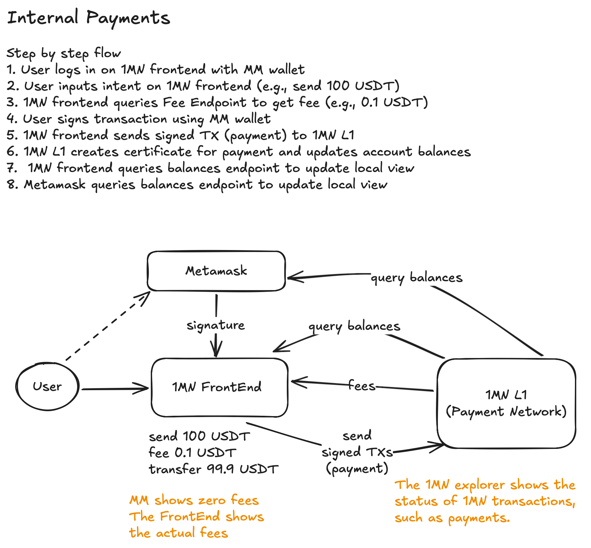
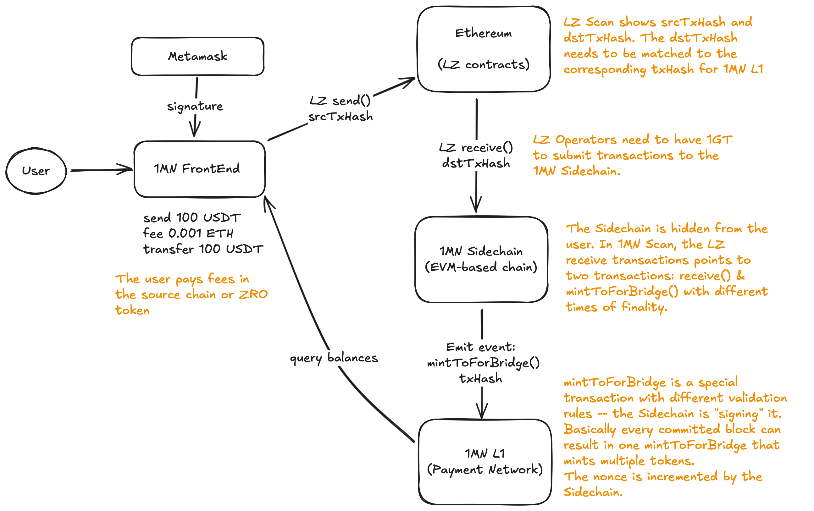
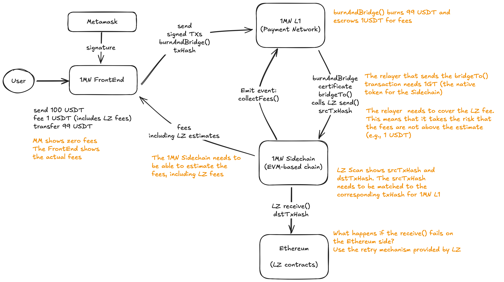
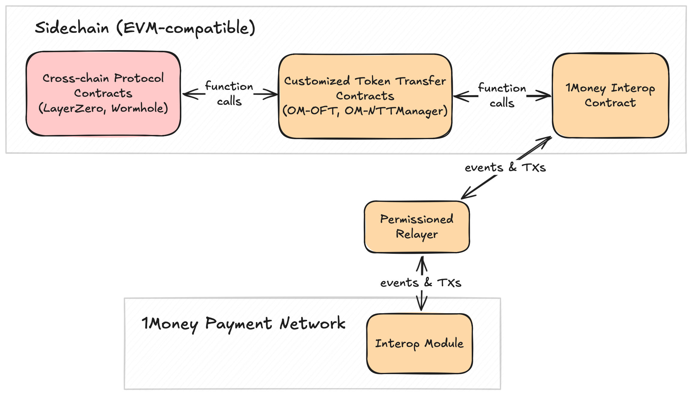

# 1Money Interoperability Protocol

## Changelog

* 2025-10-13: Initial draft

## Status

PROPOSED: Not Implemented

## Abstract

This ADR describes the design of a protocol that enables the interoperability between the 1Money Network 
and existing networks, such as Ethereum, via third-party cross-chain communication protocols, 
such as LayerZero or Wormhole. 

## Context

The 1Money Network consists of a fast payment lane that requires Byzantine Consistent Broadcast (BCB) 
and a checkpointing protocol that enables the network participants (i.e., validators) to reach agreement 
on the system state. Although the checkpointing protocol implements Byzantine consensus, it is not 
EVM-compatible, which means that it doesn't support out-of-the-box integration with cross-chain communication 
protocols, such as LayerZero or Wormhole. As a result, this ADR is proposing the addition of an EVM-compatible 
sidechain, that supports integration with cross-chain communication protocols. We refer to this as the EVM lane. 
In addition, this ADR is proposing the design of the interoperability protocol that enables the communication 
between the payment lane and the EVM lane. 

The fast payment lane allows network validators to quickly finalize user transactions, 
provided that each account submits transactions with strictly increasing, consecutive nonces.
A transaction is considered finalized once it receives signatures from at least a quorum of validators.
The signatures from at least a quorum are also known as a certificate. 
Thus, a finalized transaction is also referred to as a _certified transaction_.
Note that validators can see certified transactions from different users in different order. 
Total order requires consensus. The 1Money Network uses a checkpointing protocol to implement consensus.

On of the main requirements is for users to pay fees in the transferred token, 
e.g., if a user send a payment of 100 USDT and the fee is 0.1 USDT, 
then only 99.9 USDT being transferred and 0.1 USDT kept as fee. 
The following diagram describes the high-level design of the 1Money internal payments. 



* The user logs in on 1Money frontend with Metamask wallet (or other EVM-based wallet).
* The user inputs intent on 1Money frontend (e.g., send 100 USDT).
* 1Money frontend queries the Fee Endpoint to get fee (e.g., 0.1 USDT).
* The user signs transaction using Metamask wallet.
* 1Money frontend sends signed TX (payment) to 1Money L1 (aka the payment network).
* 1Money L1 creates a certificate for payment and updates account balances.
* 1Money frontend queries balances endpoint to update local view.
* Metamask queries balances endpoint to update local view

## Decision

The EVM-compatible sidechain is a PoA blockchain that uses [Malachite](https://github.com/circlefin/malachite) 
for consensus and [Reth](https://github.com/paradigmxyz/reth) for execution. 
The consensus participants are the same as the 1Money Network validators, which makes the sidechain more like a sidecar.

For brevity, this ADR is using Ethereum as a external chain and LayerZero as a cross-chain communication protocol. 
However, the proposed design applies to any cross-chain communication protocol that satisfies the following conditions:

* It supports EVM-compatible chains. 
* It supports cross-chain token transfer. 
* The cross-chain token transfer functionality can be customized to remove any mint (unlock) and burn (lock) logic.

Also, the external chain can be any chain supported by the cross-chain communication protocol. 

Cross-chain communication protocols deploy their logic in the form of EVM smart contracts on the sidechain. 

### High Level Design

<details>
<summary>High level design of external payments (i.e., cross-chain payments).</summary>

**External Incoming Payments (deposits).** The following diagram describes the high-level design of an external incoming payment, e.g., a user sending 100 USDT from 
Ethereum to the 1Money Network. Here is the step by step flow:

* The user logs in on the 1Money frontend with Metamask wallet (or other EVM-based wallet). 
* The user inputs intent on 1Money frontend (e.g., send 100 USDT from Ethereum to 1Money).
* 1Money frontend queries Ethereum for LayerZero fee (by calling `quote()`). The fee is in ETH or ZRO tokens.
* The user signs transaction using Metamask wallet.
* 1Money frontend sends signed transaction -- LayerZero `send()` -- to Ethereum.
* LayerZero triggers `receive()` on 1Money sidechain. LayerZero operators need to have the sidechain gas token.
* 1Money sidechain handles `receive()` by just emitting an event (no mint).
* The sidechain event acts as a `mintToForBridge` instruction for the 1Money L1 (i.e., the payment network).
* 1Money L1 creates certificate for `mintToForBridge` and updates account balances.
* 1Money frontend queries balances endpoint to update local view.



**External Outgoing Payments (withdrawals).** The following diagram describes the high-level design of an external outgoing payment, e.g., a user sending 100 USDT from 
the 1Money Network to Ethereum. Here is the step by step flow:

* The user logs in on 1Money frontend with Metamask wallet (or other EVM-based wallet). 
* The user inputs intent on 1Money frontend (e.g., send 100 USDT from 1Money to Ethereum).
* 1Money frontend queries 1Money L1 for fee estimate including the LayerZero fee. The fee is in USDT.
* The user signs transaction using Metamask wallet.
* 1Money frontend sends signed transaction -- `burnAndBridge()` -- to 1Money L1.
* 1Money L1 creates certificate for `burnAndBridge` and updates account balances (burn transfer amount and escrow fees).
* A relayer sends a `bridgeTo()` transaction (including the certificate) to the sidechain. This transaction calls LayerZero `send()`. 
* LayerZero triggers `receive()` on Ethereum. 
* Once LayerZero transfer is finalize (on `bridgeTo` success), the relayer sends a `collectFees` transaction to 1Money L1. 
* 1Money L1 creates certificate for `collectFees` and escrowed fees are sent to the relayer. 
* 1Money frontend queries balances endpoint to update local view. 


</details>

### Main Components

The following diagram describes the components necessary to enable interoperability with external chains. 
The components in red are dependencies, while the ones in orange are within the scope of this ADR. 



* **Customized Token Transfer Contracts.** These are customized contracts that replace mint (unlock) and burn (lock) 
  logic with calls into the _1Money Interop Contract_ (see below).
* **1Money Interop Contract.** A contract (i.e., `OMInterop.sol`) that acts as an interface between the 1Money Network 
  and third-party cross-chain protocols, such as LayerZero or Wormhole. This contract contains the logic that enables 
  the _Permissioned Relayer_ (see below) to translate events from the sidechain to actions on the payment network.
* **Permissioned Relayer.** An off-chain _permissioned_ relayer that translates events on both sidechain and payment network 
  into actions on the other side. 
* **Interop Module.** A module on the 1Money payment network that contains logic to mint incoming cross-chain tokens 
  and to burn outgoing cross-chain tokens. 

### Interop Module

The Interop Module introduces three new instructions to the payment network: `MintToForBridge`, `BurnAndBridge`, and `CollectFees`

#### MintToForBridge

Creates new cross-chain tokens and adds them to a specified account. 

Parameters:

* `amount: U256` -- The amount of tokens to mint
* `address: Address` -- The recipient's wallet address

Required Permissions:

* The transaction signer must be the Permissioned Relayer. 
* The token must not be paused.

> TBD: Can the recipient be blacklisted? 
  
Notes:

* Minting increases the token's total supply.
* The recipient's token account is created automatically if it doesn't exist.
* To ensure subsequent nonces, the nonce is determined by the sidechain. 
* Before a cross-chain token can be minted, it first needs to be created via the `CreateNewToken` instruction. The 
  `master_authority` is set to the Permissioned Relayer.

#### BurnAndBridge

Destroys cross-chain tokens by removing them from a specified account and transferring them to another account on 
a destination chain. 

Parameters:

* `amount: U256` -- The amount of tokens to burn and bridge
* `address: Address` -- The recipient's wallet address
* `dstChainId: U256` -- The destination chain ID
* `escrowFee: U256` -- The bridging fee necessary to escrow for transferring the tokens to the destination chain

Required Permissions:

* The transaction signer must be the owner of the source token account
* The token must not be paused
* The sender cannot be blacklisted

Notes:

* Transfers fail if the sender has insufficient balance
* The `amount` indicates the total amount including the payment network fees (i.e., `fee`) and the `escrowFee`.
  The amount burned and bridged to the destination chain is `amount - fee - escrowFee`.
* Burning decreases the token's total supply
* The bridging fee is escrowed in a special account owned by the Permissioned Relayer.
* The `dstChainId` is specific to the cross-chain communication protocol and is public information 
  (see [here](https://wormhole.com/docs/products/reference/chain-ids/) for Wormhole
  and [here](https://docs.layerzero.network/v2/deployments/deployed-contracts) for LayerZero).
* For every account, there is an additional sequential nonce (i.e., `bbNonce`) 
  that is incremented only for BurnAndBridge instructions.

#### CollectFees

Transfer fees for cross-chain transfers from the special escrow account. 

Parameters:

* `fee: U256` -- The actual amount paid by the relayer in fees for a cross-chain transfer
* `feeAddress: Address` -- The recipient's wallet address for the fee amount
* `refund: U256` -- The amount to be refunded to the user (i.e., `escrowFee - fee`)
* `refundAddress: Address` -- The recipient's wallet address for the refund amount

Required Permissions:

* The transaction signer must be the Permissioned Relayer 
* The refund address cannot be blacklisted
* The fee address cannot be blacklisted

### 1Money Interop Contract

The `OMInterop.sol` contract acts as an interface between the 1Money Network and third-party cross-chain protocols, 
such as LayerZero or Wormhole. Specifically, the contract enables the Permissioned Relayer to listen to cross-chain 
events and to trigger cross-chain actions on the sidechain.

At a minimum, `OMInterop.sol` should define the following events and external functions:
* `event OMInteropReceived` emitted when cross-chain tokens are received on the sidechain, i.e., the `receive()` call 
  of the corresponding cross-chain protocol was successful.
* `event OMInteropSent` emitted when cross-chain tokens are sent on the sidechain, i.e., the `send()` call 
  of the corresponding cross-chain protocol was successful.
* `function bridgeFrom` called by the Customized Token Transfer Contracts instead of mint. The function emits `OMInteropReceived`.
* `function bridgeTo` called by the Permissioned Relayer. The function calls the `send()` function of the corresponding 
  cross-chain token transfer protocol and emits `OMInteropSent`. 
* `function updateCheckpointInfo` called by the Permissioned Relayer to update the sidechain's view on the latest 
  payment network checkpoint.

  ```solidity
    interface IOMInterop {
        // Events
        event OMInteropReceived(
            uint64 nonce, // Nonce used by the relayer to submit a payment
            address to, // Destination account
            uint256 amount, // Amount of tokens to mint
            address omToken // The token address on the 1Money payment network
        );
        event OMInteropSent(
            uint64 nonce, // Nonce used by the relayer to submit a payment
            address from, // Source account (needed to refund the unused fee)
            uint256 feeAmount, // Amount of tokens to transfer to the relayer
            uint256 refundAmount, // Amount of tokens to refund the user (refundAmount = escrowFee - feeAmount)
            address omToken // The token address on the 1Money payment network
        )
        
        // bridgeFrom emits OMInteropReceived
        function bridgeFrom(
            address to,
            uint256 amount
        ) external;

        // bridgeTo first calls the send() method of the corresponding 
        // cross-chain token transfer protocol 
        // and then emits OMInteropSent
        function bridgeTo(
            address from,
            uint64 bbNonce, // BurnAndBridge nonce from the BurnAndBridge instruction
            address to,
            uint256 amount,
            uint32 dstChainId,
            uint256 escrowFee,
            address omToken,
            uint64 checkpointId,
        ) external;

        function updateCheckpointInfo(
            uint64 checkpointId,
            uint32 burnAndBridgeCount // number of certified BurnAndBridge instructions in checkpoint checkpointId 
        ) external;

        function getLatestCompletedCheckpoint() external view returns (uint64 checkpointId);

        function mapTokenAddresses(
            address omToken, // token address on payment network
            address scToken, // token address on sidechain
            uint8 interopProtoId, // cross-chain protocol identifier
        ) external;
    }
  ```

#### Token Address Mapping

`OMInterop.sol` needs to keep a mapping of token addresses between the 1Money payment network and the sidechain. 
This mapping is populated by the 1Money Network Operator by submitting `mapTokenAddresses` transactions. 
The operator is responsible for deploying Customized Token Transfer Contracts on the sidechain 
and for submitting corresponding `CreateNewToken` instructions to the payment network. 
The mapping should also contain information on the specific cross-chain token transfer protocol. 

#### Track Missing BurnAndBridge Certificates

The Permissioned Relayer submits a `updateCheckpointInfo` transaction for every checkpoint `cp` with 
information on the number of `BurnAndBridge` instructions certified in checkpoint `cp`.
The `OMInterop.sol` contract keeps a mapping from checkpoint ID to a tuple `(certified, completed)`, where

* `certified` is the number of certified `BurnAndBridge` instructions (updated by `updateCheckpointInfo()`).
* `completed` is the number of completed `BurnAndBridge` instructions.  
  A completed `BurnAndBridge` instruction is one with a matching `bridgeTo` call that was successful.
  Thus, `completed` is updated by `bridgeTo()`.

To prune the checkpoint map, all the entries with `certified = completed` can be pruned, 
except the one with the highest checkpoint ID. This entry needed by the `getLatestCompletedCheckpoint()` function. 

#### BridgeTo Anti-Replay Mechanism 

`OMInterop.sol` should drop duplicate calls to `bridgeTo()`, i.e., if the Permissioned Relayer submits 
multiple `bridgeTo` transactions for the same certified `BurnAndBridge` instruction, only the first results
in a call to the `send()` function of the corresponding cross-chain token transfer protocol.
For this, `OMInterop.sol` keeps a mapping from 1Money user account to the latest received `bbNonce`. 
Note that this is not the same as the account nonce (which is incremented for any instruction submitted by that account). 
The call to `bridgeTo()` reverts if the `bbNonce` in the argument is not exactly the nonce in the mapping plus one.   

#### Upgradability

To enable modifications of the `OMInterop.sol` contract after deployment, 
the [UUPS](https://docs.openzeppelin.com/contracts-stylus/uups-proxy) pattern should be used.
UUPS allows for upgradeable smart contracts by separating the contract's state 
(held in a proxy contract) from its logic (in an implementation contract). 
For security, upgrades must be restricted to trusted accounts, such as the 1Money Network Operator.

> TODO: decide on storage layout

### Permissioned Relayer 

The Permissioned Relayer connects the 1Money Interop Module with the 1Money Interop Contract. 
This entails sending transactions to both payment network and sidechain. Also, the relayer must be able 
to query events on both networks, including past events in case of crashes. 

Note that the relayer is permissioned, which means it is trusted for both safety and liveness. 
In future iterations, when the payment network and the sidechain will share a common state, the protocol 
should be adapted to work without a permissioned relayer.

#### Submit Payment Network Transaction 

The relayer must submit both `MintToForBridge` and `CollectFees` instructions to the payment network. 
As the relayer must sign both of these instructions, it must use a nonce that is strictly increasing without gaps. 
To ensure that no nonces are missed even if the relayer crashes, the 1Money Interop Contract maintains the nonce 
in its state and increments it for every event emitted (either `OMInteropReceived` or `OMInteropSent`).

Given that the relayer is permissioned, it doesn't need to pay fees to submit transactions to the payment network. 

#### Query Sidechain 

The relayer queries the sidechain for events emitted by the `OMInterop.sol` contract (`OMInteropReceived` and `OMInteropSent`). 
This can be done by setting the relayer in listen mode and act on every emitted event. 

Even in the case of a crash, the relayer cannot miss any events (as the nonce must be strictly increasing without gaps).
Thus, the relayer must be able to recover after a crash and query past events. 
The relayer will use the following algorithm:

* Use the `/v1/accounts/nonce` REST API to query the payment network for the latest nonce `nonce` for the relayer account.
* Query the sidechain going backwards from the current height until retrieving all `OMInterop.sol` events with nonce 
  `>= nonce`. 
* Submit all the corresponding instructions for the events starting with nonce `nonce+1`. 
  Note that some of these transactions might have already been submitted before (in the case the queried payment node 
  didn't have the latest view). In this case, the duplicate transaction will just be dropped by the payment network. 

#### Query Payment Network 

The relayer queries the payment network for certified `BurnAndBridge` instructions. 
This can be done by setting the relayer in listen mode and act on every `BurnAndBridge` instruction 
(i.e., submit a matching `bridgeTo` transaction to the sidechain).

Even in the case of a crash, the relayer cannot miss any certified `BurnAndBridge` instructions
(otherwise the tokens would be burned on the payment network without ever being received on the destination chain).
Thus, the relayer must be able to recover after a crash and query missing certified `BurnAndBridge`.
The relayer will use the following algorithm:

* Get the latest completed `checkpointId` by calling the `getLatestCompletedCheckpoint` function of the `OMInterop.sol` contract.
* Get all the certified `BurnAndBridge` instructions starting with `checkpointId+1` and submit a matching `bridgeTo`
  transaction to the sidechain. Note that some of these certified `BurnAndBridge` instructions are already completed 
  (i.e., a matching `bridgeTo` transaction was already sent before the relayer crashed). These duplicate transactions 
  will be dropped due to the anti-replay mechanism.  

#### Submit Sidechain Transaction 

The relayer submits `bridgeTo` transaction to the sidechain. For this, it needs to have gas tokens. 

### Customized Token Transfer Contracts

In the case of LayerZero, the [OFT.sol](https://github.com/LayerZero-Labs/LayerZero-v2/blob/main/packages/layerzero-v2/evm/oapp/contracts/oft/OFT.sol) 
contract needs to be extended to remove the `_burn()` and `_mint()` calls from `_debit()` and `_credit`, respectively.
The `_mint(_to, _amount)` should be replaced by a call to the `bridgeFrom(_to, _amount)` function of the `OMInterop.sol` contract.
An instance of the extended `OFT.sol` contract (i.e., `OM-OFT.sol`) will be deployed on the sidechain for every supported cross-chain token.

In the case of Wormhole, the [NttManager.sol](https://github.com/wormhole-foundation/native-token-transfers/blob/main/evm/src/NttManager/NttManager.sol)
contract needs to be extended. Specifically, the `_handleMsg` needs to be overridden to remove any mint (unlock) and burn (lock) logic. 
Similarly to LayerZero, the mint calls should be replaced by a call to the `bridgeFrom()` function of the `OMInterop.sol` contract.

### Rate Limiting

For safety reasons, external payments (both deposits and withdrawals) need to be rate limited. 

#### Deposits

To avoid scenarios where assets are transferred to the 1Money network, but never minted to the destination account, 
deposits must be rate limited on the sidechain. As a result, if the limit is exceeded for a cross-chain transfer, 
then the `bridgeFrom()` call reverts, which means the transfer reverts. 
This requires implementing the following rate limiting algorithm in the `OMInterop.sol` contract. 
For every cross-chain token `TOK`: 

* Define a rate limit time window (i.e., `RLTW`) and a max threshold (i.e., `allowance`).
* Let `receivedAmount` be the amount of `TOK` received during the current `RLTW`. Initialize `receivedAmount` to zero.
* When receiving `x` amount of `TOK`, if `receivedAmount + x > allowance`, revert `bridgeFrom()`. Otherwise, `receivedAmount += x`.
* Every `RLTW`, reset `receivedAmount` to zero.

Both `RLTW` and `allowance` can be updated by an admin, such as the 1Money Network Operator.
When this happens, `receivedAmount` is reset to zero.

Note that the values of `RLTW` and `allowance` should be set such that it provides safety 
(i.e., mitigates the risks of an attack), but it doesn't affect the UX by limiting valid user deposits. 

#### Withdrawals

To avoid scenarios where assets are burned on the 1Money network, but never transferred to the destination chain, 
withdrawals must be rate limited on the payment network. As a result, if the limit is exceeded for a cross-chain transfer,
then the `BurnAndBridge` instruction fails, which means the transfer fails. 
This requires implementing the following rate limiting algorithm in the Interop Module.
For every cross-chain token `TOK`: 

* Define a rate limit time window (i.e., `RLTW`) and a max threshold (i.e., `allowance`).
* Let `burnedAmount` be the amount of `TOK` burned (and transferred out) during the current `RLTW`. 
  Initialize `burnedAmount` to zero. 
  Note that `burnedAmount` is local to every 1Money validator -- it represents the amount of `TOK` 
  the validator agreed to burn by signing `BurnAndBridge` instructions.
* When a validator receives a `BurnAndBridge` instruction with `amount = x` 
  (i.e., request to withdraw `x` amount of `TOK`), 
  if `burnedAmount + x > allowance`, then it considers the `BurnAndBridge` instruction as invalid. 
  Otherwise, if the rest of the validation is successful, it signs the `BurnAndBridge` instruction and `burnedAmount += x`.
* Every `RLTW`, every validator resets its own `burnedAmount` to zero.
  
Both `RLTW` and `allowance` can be updated by an admin, such as the 1Money Network Operator (via governance proposals).
When this happens, `burnedAmount` is reset to zero for all validators.

Note that the values of `RLTW` and `allowance` should be set such that it provides safety 
(i.e., mitigates the risks of an attack), but it doesn't affect the UX by limiting valid user withdrawals. 
Also, note that although every validator allows up to `allowance` "burns" per `RLTW`, 
since validators might use their allowances for different `BurnAndBridge` instructions, it is possible that 
this rate limiting algorithm imposes a stricter limit on withdrawals. 

### Matching Transaction Hashes

To enable the tracking of cross-chain transfer, there needs to be the following mappings:

* Transaction hashes of `BurnAndBridge` instructions on the payment network must 
  be mapped to transaction hashes of `bridgeTo` sidechain transactions. 
* Transaction hashes of sidechain transactions that result in calls to `bridgeFrom()` must 
  be mapped to transaction hashes of `MintToForBridge` instructions on the payment network.

> TODO where are these mappings stored? The mappings are needed by the 1Money transaction explorer. 

## Consequences

* The Permissioned Relayer guarantees the liveness of the interoperability protocol. 
  This means that if the relayer is down, cross-chain transfers are unavailable. 
  Also, if the relayer crashes, the recovery requires waiting for a checkpoint of the payment network. 
  Thus, cross-chain transfers might be delayed until the checkpoint is completed.

## Invariants

* Every successful `BurnAndBridge` on the payment network will eventually 
  result in a matching successful call to `bridgeTo()` on the sidechain. 
  * This entails the following invariant: 
    Calls to `bridgeTo()` from the Permissioned Relayer cannot revert.
* Every successful call to `bridgeTo()` on the sidechain will eventually
  result in a matching certified `CollectFees` instruction on the payment network.
  * This entails the following invariant:
    `CollectFees` instructions sent by the Permissioned Relayer cannot fail.
* Every cross-chain token successfully received on the sidechain will eventually 
  result in a matching certified `MintToForBridge` instruction on the payment network. 
  * This entails the following invariant:
    `MintToForBridge` instructions sent by the Permissioned Relayer cannot fail.

> TODO add more invariants

## References

* [Malachite](https://github.com/circlefin/malachite) 
* [Reth](https://github.com/paradigmxyz/reth)
* [LayerZero OFT.sol](https://github.com/LayerZero-Labs/LayerZero-v2/blob/main/packages/layerzero-v2/evm/oapp/contracts/oft/OFT.sol)
* [Wormhole NttManager.sol](https://github.com/wormhole-foundation/native-token-transfers/blob/main/evm/src/NttManager/NttManager.sol)
* [UUPS](https://docs.openzeppelin.com/contracts-stylus/uups-proxy)